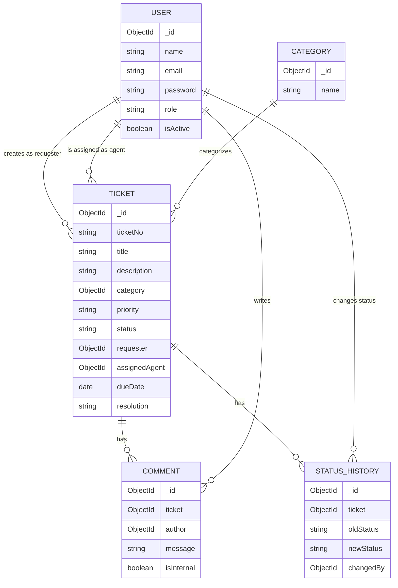

```mermaid
erDiagram
    USER {
        ObjectId _id
        string name
        string email
        string password
        string role
        boolean isActive
    }

    CATEGORY {
        ObjectId _id
        string name
    }

    TICKET {
        ObjectId _id
        string ticketNo
        string title
        string description
        ObjectId category
        string priority
        string status
        ObjectId requester
        ObjectId assignedAgent
        date dueDate
        string resolution
    }

    COMMENT {
        ObjectId _id
        ObjectId ticket
        ObjectId author
        string message
        boolean isInternal
    }

    STATUS_HISTORY {
        ObjectId _id
        ObjectId ticket
        string oldStatus
        string newStatus
        ObjectId changedBy
    }

    USER ||--o{ TICKET : "creates as requester"
    USER ||--o{ TICKET : "is assigned as agent"
    CATEGORY ||--o{ TICKET : "categorizes"

    TICKET ||--o{ COMMENT : "has"
    USER ||--o{ COMMENT : "writes"

    TICKET ||--o{ STATUS_HISTORY : "has"
    USER ||--o{ STATUS_HISTORY : "changes status"
```